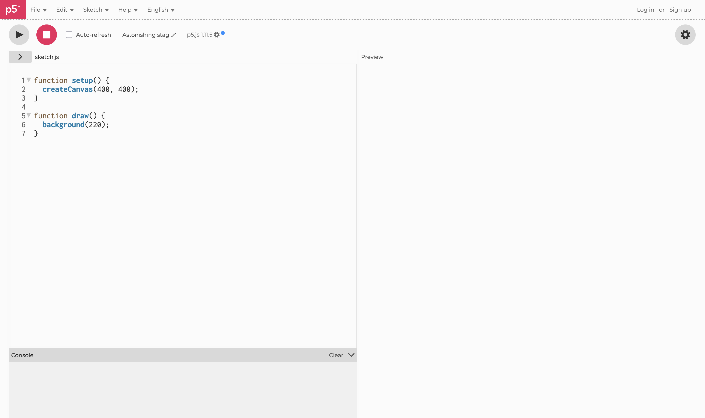
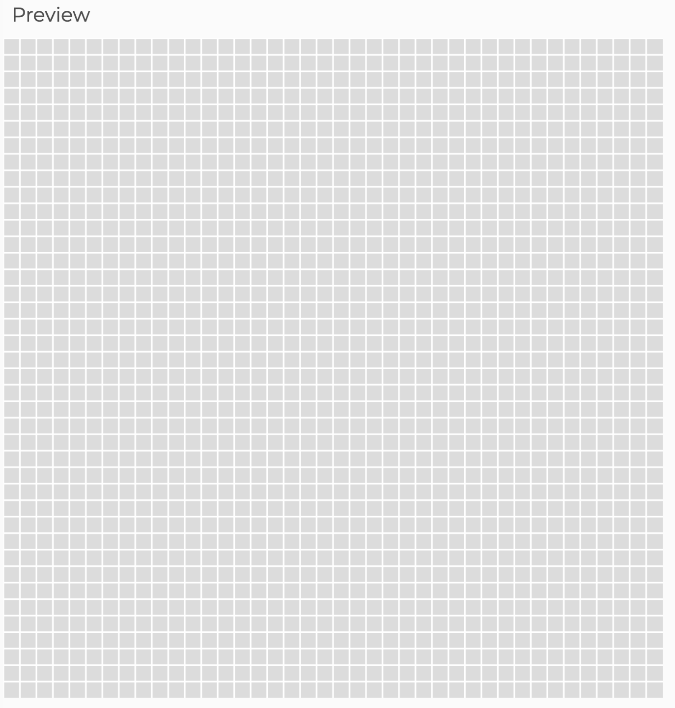
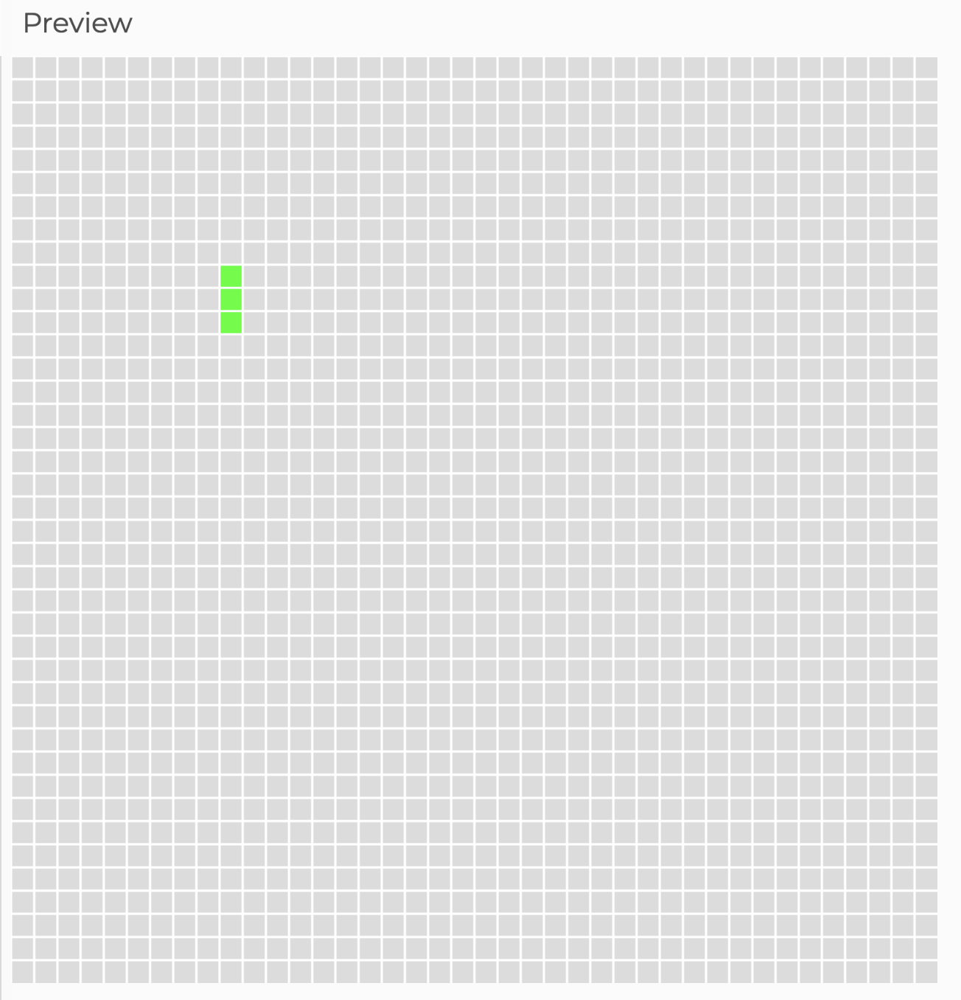
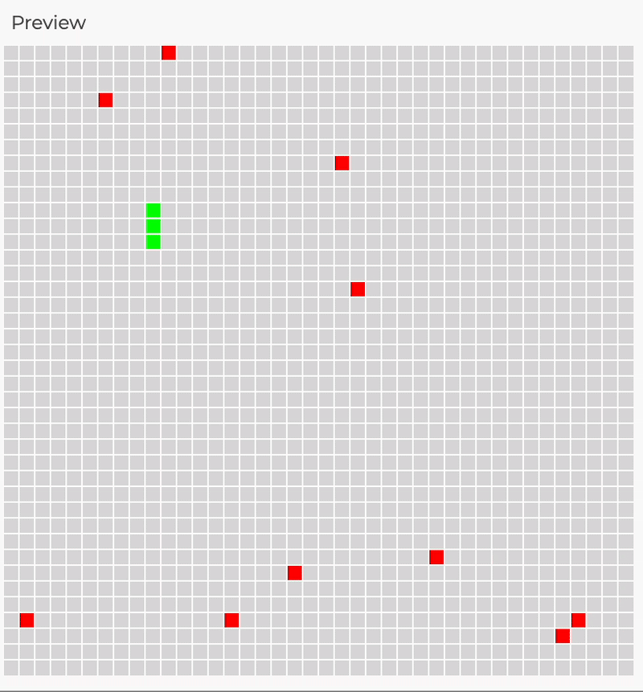
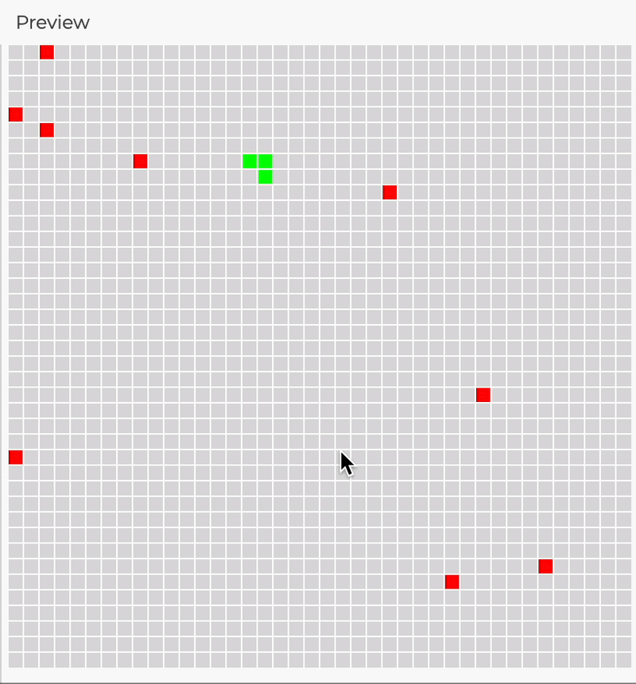

# Lore

Tes parents ont certainement passé des heures à jouer au snake sur leur NOKIA 3310... et ça ressemblait à ça


Ta mission est de voyager dans le passé, plus précisément le 12 octobre 2000 le jour de la sortie du Nokia 3310, et de coder le jeu du snake pour rendre addict toute une génération qui ne manquera pas de te dire dans le futur que tu passes trop de temps sur les écrans.

--- 

# Pré-requis

Ouvre ce lien dans ton navigateur préféré <https://editor.p5js.org/> et c'est parti



L'éditeur est composé de quatre parties :

1. Une barre de menu avec le ▶️ et ⏹️ pour exécuter et arrêter le programme.
2. Une zone à gauche qui permet d'écrire du code
3. Une zone à droite "preview" qui permet de voir le résultat
4. Une zone en bas à gauche "console" pour t'aider à trouver les bugs dans ton code

### Astuce

Coche la case ✅ « Auto-refresh » pour une mise à jour automatique

---

# Dessiner la grille

En dessinant une grille sur l'espace d'affichage, tu vas ajouter des repères qui vont aider à la création du jeu.

## Tutoriel

Tu vas utiliser la fonction `line()` pour tracer une ligne dans la zone d'affichage. Tu peux trouver des explications sur l'utilisation de cette fonction dans la référence de p5js qui est une documentation technique en ligne : <https://p5js.org/reference/p5/line/>

```javascript
function setup() {
  createCanvas(400, 400);
}

function draw() {
  background(220);
  line(0,0,10,40);
}
```

Maintenant tu vas apprendre à utiliser une boucle `for`, à la différence de le fonction `line` cette instruction n'est pas spécifique à p5.js, c'est une fonctionnalité du langage javascript. Comme pour p5.js, il existe une documentation technique en ligne pour t'aider : <https://developer.mozilla.org/fr/docs/Web/JavaScript/Reference/Statements/for>

Dans cette deuxième étape, tu vas dessiner 10 lignes espacées à chaque fois de 10 pixels avec une seule instruction `line` grâce à une boucle `for`

```javascript
function setup() {
  createCanvas(400, 400);
}

function draw() {
  background(220);
  for (i=0; i < 10; i++)
  {
    line(i*10,0,i*10,40);
  }
}
```

## Exercice

Ton objectif est de dessiner une grille blanche sur l'ensemble de ton espace d'affichage



### Indice

- Dans la référence p5.js, tu peux retrouver la fonction <https://p5js.org/reference/p5/stroke/> qui va te permettre de changer la couleur de tes lignes
- Tu peux ajouter plusieurs instructions à l'intérieure de ta boucle `for`

---

# Dessiner le serpent

En dessinant des carrés colorés les uns à coté des autres sur la grille, tu vas voir apparaître ton serpent

## Tutoriel

Dans cette partie, tu vas apprendre à utiliser les tableaux en javascript <https://developer.mozilla.org/fr/docs/Web/JavaScript/Reference/Global_Objects/Array>. Dans un premier temps, tu vas créer un tableau `snake` et ensuite remplir 3 cases du tableaux avec la méthode `push`

```javascript
function setup() {
  createCanvas(400, 400);
  snake = [];
  snake.push([90, 90]);
  snake.push([90, 100]);
  snake.push([90, 110]);
}

function draw() {
  background(220);
  rect(50,60,10,20);
}
```

Grâce à l'instruction `foreach` tu vas pouvoir parcourir tous les éléments du tableau, dans cette exemple tu vas afficher tous les éléments de ton tableau dans la console que tu peux retrouver en dessous de ta fenêtre de code

```javascript
function setup() {
  createCanvas(400, 400);
  snake = [];
  snake.push([90, 90]);
  snake.push([90, 100]);
  snake.push([90, 110]);
  snake.forEach((element) => {
    console.log(element[0],element[1]);
  });
}

function draw() {
  background(220);
  rect(50,60,10,20);
}
```

Et enfin tu vas dessiner un rectangle dans la fenêtre de preview grâce à la fonction `rect` : <https://p5js.org/reference/p5/rect/>

```javascript
function setup() {
  createCanvas(400, 400);
}

function draw() {
  background(220);
  rect(50,60,10,20);
}
```

## Exercice

Ton objectif est de dessiner ton serpent avec les caractéristiques suivantes : couleur verte et longueur de 3 cases en utilisant un tableau, l'instruction `foreach` et la fonction `rect`



### Indice

- La fonction `draw` permet d'ajouter toutes les fonctions ou les instructions en rapport avec l'affichage
- la fonction `fill` de p5.js est très utile pour réaliser cet exercice

---

# Déplacer le serpent

Cette partie nécessite une bonne connaissance des mécanismes du langage javascript et de p5.js, tu vas utiliser chaque éléments de la boite à outils ci-dessous et faire en sorte que cela fonctionne dans ton programme.


## Boite à outils

Grâce à la fonction `keyPressed`, tu vas mettre à jour la variable `snake_direction` lorsque tu appuies sur les flèches de ton clavier ◀️ 🔼 🔽 ▶️

```javascript
// IMPORTANT 
// il faut déclarer la variable snake_direction et l'initaliser dans la fonction setup()
// snake_direction = "down";

function keyPressed() {
  if (keyCode == UP_ARROW) {
    snake_direction = "up";
  } else if (keyCode == DOWN_ARROW) {
    snake_direction = "down";
  } else if (keyCode == LEFT_ARROW) {
    snake_direction = "left";
  } else if (keyCode == RIGHT_ARROW) {
    snake_direction = "right";
  }
}
```

Grâce à la fonction `next_direction`, tu vas calculer la prochaine position de la tête du serpent et mettre à jour la variable `snake_next_direction`, le principe est d'ajouter ou de retirer 10 pixels au coordonnées x ou y en fonction de la prochaine direction de la tête du serpent.

```javascript
function next_direction() {
  snake_next_direction = null;
  if (snake_direction == "up") {
    snake_next_direction = [snake[0][0], snake[0][1] - 10];
  } else if (snake_direction == "down") {
    snake_next_direction = [snake[0][0], snake[0][1] + 10];
  } else if (snake_direction == "left") {
    snake_next_direction = [snake[0][0] - 10, snake[0][1]];
  } else if (snake_direction == "right") {
    snake_next_direction = [snake[0][0] + 10, snake[0][1]];
  }
}
```

Grâce à la fonction `move_snake`, tu vas modifier les éléments du tableau `snake` grâce à la méthode `snake.pop()` et `snake.unshift()`.

```javascript
function move_snake() {
  snake.pop(); // supprime le dernier élément d'un tableau
  snake.unshift(snake_next_direction);  //ajoute un élément au début d'un tableau
}
```

Une fois le tableau modifié, tu n'as pas à t'occuper de l'affichage — le code rédigé à l'étape précédente **"Dessiner le serpent"** s'occupera d'afficher le serpent au bon endroit.

Et enfin, la mise en place de la boucle de jeu grâce à la fonction `setInterval` qui va exécuter toutes les 250 ms nos 3 fonctions `keyPressed()`, `next_direction()`, `move_snake()`

```javascript
function setup() {
  createCanvas(400, 400);
  init_snake();
  snake_direction = "down";
  setInterval(() => {
    keyPressed();
    next_direction();
    move_snake();
  }, 250);
}
```
---

# Afficher les pommes

## Tutoriel

Grâce aux fonctions mathématiques `floor` et `random`, tu peux générer un nombre entier aléatoire, par exemple entre 1 et 10. Voici un exemple dans la fonction `setup()` qui va générer un nombre aléatoire et l'afficher dans la console

```javascript
function setup() {
  createCanvas(400, 400);
  console.log(Math.floor(random(1, 11)));
}
```

## Exercice

Ton objectif est de dessiner 10 pommes de couleur rouge placées sur la grille de manière aléatoire. Tu vas créer un nouveau tableau `apples` et deux fonctions `create_apples()` et `draw_apples()`



### Indices

- Pour créer les pommes, tu peux utiliser une boucle `for` et un tableau, les fonctions mathématiques `floor` et `random` ainsi que la méthode `push`
- Pour afficher les pommes, tu peux t'inspirer de la fonction d'affichage du serpent et utiliser l'instruction `foreach` et les fonctions `fill()` et `rect()`

---

# Manger les pommes

## Tutoriel

Tu vas apprendre à utiliser l'instruction `if`. Si tu as lu attentivement le code de la boite à outils que tu as utilisé pour faire en sorte que ton serpent se déplace, tu as du remarquer que nous utilisions cette instruction que nous appelons en programmation une condition. <https://developer.mozilla.org/fr/docs/Web/JavaScript/Reference/Statements/if...else>

```javascript
// Dans cet exemple, tu vas ajouter une condition dans la boucle de jeu
// qui affiche un message dans la console 
// lorsque le serpent se déplace vers la gauche

setInterval(() => {
  if ( snake_direction == "left") {
    console.log("Le serpent se déplace vers la gauche");
  }
}, 250);
```

Pour supprimer un élément d'un tableau, tu va utiliser avec la méthode `splice`. La méthode `splice` prend en paramètre l'index de l'élément que tu veux supprimer. Pour trouver cet index, utilise la méthode `indexOf`

```javascript
// Dans cet exemple, tu vas supprimer l'élément à l'index 4 du tableau apples
// On peut vérifier dans la console qu'il y a un élement en moins 
// et que c'est bien l'élément qui était à l'index 4

apples.forEach((element) => {
  console.log("avant splice",apples.indexOf(element), apples[apples.indexOf(element)]);
});

apples.splice(4,1);

apples.forEach((element) => {
  console.log("après splice",apples.indexOf(element), apples[apples.indexOf(element)]);
});
```

## Exercice

Ton objectif est de faire en sorte que ton serpent grandisse quand il mange une pomme et que cette pomme disparaisse.



### Indices

- Dans la fonction `move_snake()`, ajoute une condition `if` qui va tester la variable `eat` et qui déclenche le `snake.pop()` au bon moment.
- Grâce aux méthodes `indexof` et `splice` dans une boucle `foreach` tu dois pouvoir supprimer la pomme qui vient d'être mangé par ton serpent du tableau `apples`

---

# Gérer les collisions

## Exercice

Tu dois remplir deux objectifs dans cet exercice :

1. Faire en sorte que le jeu s'arrête lorsque la tête du serpent rentre en collision avec un des éléments de sa queue
2. Ne pas autoriser le retour sur ces pas pour améliorer le gameplay : par exemple si ton serpent se déplace vers la droite, alors l'appuie sur la flèche du clavier gauche ◀️ est inactif

### Indices

- Pour remplir ton premier objectif, tu vas créer une nouvelle fonction `check_collision()` et l'appeler dans ta fonction `move_snake` : tu dois utiliser toutes les connaissances acquises dans cet atelier pour trouver une solution 🤔. Tu peux utiliser la fonction `noloop()` pour arrêter la boucle de jeu.
- Tu arriveras à remplir ton deuxième objectif en mettant à jour la fonction `keyPressed()` en modifiant les conditions dans les `if` grâce à l'opérateur logique `&&` <https://developer.mozilla.org/fr/docs/Web/JavaScript/Reference/Operators/Logical_AND>

---

# Bonus : Aller plus loin

- Ajoute un système de score, qui compte le nombre de points en fonction de la taille du serpent, de la durée du jeu, du nombre de pommes mangées...
- Rend le serpent multicolore et ajouter une couleur de fond.
- Utilise des images pour les blocs au lieu d'utiliser des rectangles.
- Ajoute des sons et une musique

---

# Crédits

Cet atelier a été écrit et testé à Epitech Montpellier 💙 pour le Coding Club.
